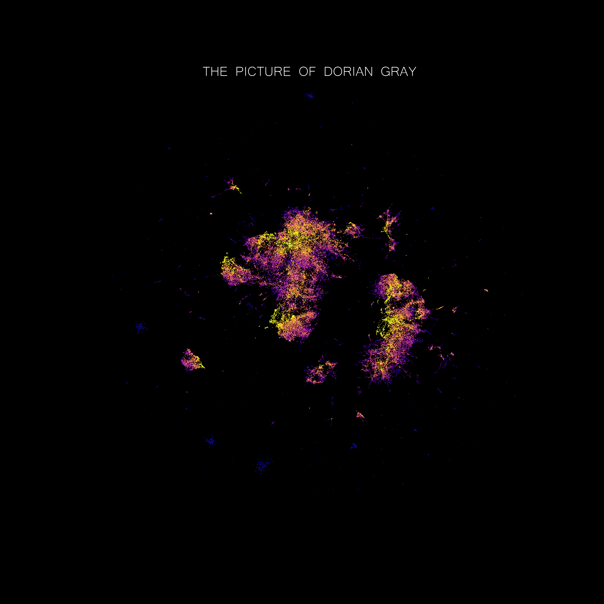

# What do Books Look Like?
This project aims to visualize the representation learned by a word-level language model trained on a collection of classics of the literature. The aim is purely aesthetic and not scientific, what presented here should be interpreted with caution (or not intepreted at all).

This project was inspired by [What do numbers look like](https://johnhw.github.io/umap_primes/index.md.html).

<video 
 src="page/videos/league.mp4" 
 width="500" 
 height="500" 
 controls preload>
</video>  

 ### The League of Extraordinary Gentlemen

  
   
  
  
   
  

## Motivation

## Features

## How to Use

## Credits

## License 
[The MIT License](https://github.com/vb690/what_do_books_look_like/blob/master/LICENSE)

