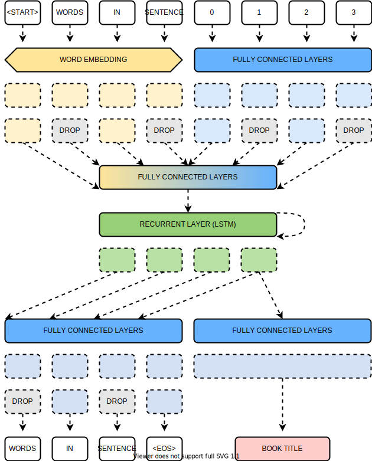
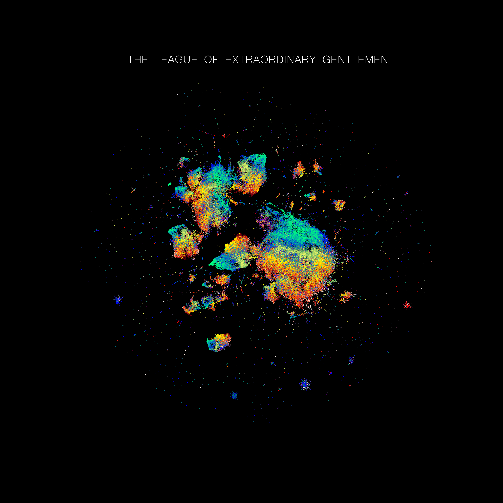

<video 
 src="page/videos/league.mp4" width="700" height="700" controls preload> 
</video>  
 
This project aims to visualize the representation learned by a word-level language model trained on a collection of classics of the literature. The aim is purely aesthetic and not scientific, what presented here should be interpreted with caution (or not intepreted at all).

This project was inspired by [What do numbers look like](https://johnhw.github.io/umap_primes/index.md.html).

## Motivation

## Features

* Automated data preparation: from PDF to numpy arrays.
* Integrated hyper-parameters tuning for the language model.
* Possibility to grid-serach UMAP hyper-parameters.

### Language Model and Encoder

The Artificial Neural Network architecture used for this project was implemented according to the following architecture:

<p align="center">
  
</p>

For extracting the representation learned by the model we constructed an encoder composed by all the transformation perfromed by the model in its first portion:

<p align="center">
  
</p>

## How to Use

1. Create a folder in `data/raw` named `your_project_name`.
2. Populate the the `your_project_name` with the books you want to embed in PDF format.
3. In `data/jsons` create `your_project_name.json` mapping the title of each book to a valid `matplolib` colormap.
```python
{
  "Dracula": "Reds",
  "The Picture of Dorian Gray": "plasma",
  "Strange Case of Dr Jekyll and Mr Hyde": "viridis",
  "King Solomon's Mines": "autumn",
  "Twenty Thousand Leagues Under the Sea": "winter",
  "The Invisible Man": "summer"
}
```
4. From the terminal, launch `run_pipeline.py` and specify `your_project_name` when propted to do so.  
  
Alternatively, each script in `run_pipeline.py` can be launched separately (in case a specific step needs to be executed in isolation)
  
5. When the script is done (this can take quite some time), use the notebook `generate_visuals.ipynb` for obtaining the visuals.

## The League of Extraordinary Gentlemen

### Embedding of the entire collection of books
  
<p align="center">
  
</p>
   
### Embedding of specific books  
  
<p align="center">
  
   
  
  
   
  
</p>  
  
### Evolution of sentences in a single embedding  
  
<p align="center">
  
</p>  
  
## Credits

* The core idea for this project comes from [What do numbers look like](https://johnhw.github.io/umap_primes/index.md.html).  
* The PDF files used for producing the examples in this repository come from [Project Guttenberg](https://www.gutenberg.org/).  
* The selection of novels was inspired by [The League of Extraordinary Gentlemen](https://en.wikipedia.org/wiki/The_League_of_Extraordinary_Gentlemen) co-created by Alan Moore and Kevin O'Neill.  
* The selected novels have been created by:  
  1. **Dracula** by Bram Stoker.  
  2. **King Solomon's Mines** by Sir Henry Rider Haggard.
  3. **The Invisible Man** by Herbert George Wells
  4. **The Picture of Dorian Gray** by Oscar Fingal O'Flahertie Wills Wilde.
  5. **The Strange Case of Dr Jekyll and Mr Hyde** by Robert Louis Stevenson.
  6. **Twenty Thousand Leagues Under the Sea** by Jules Gabriel Verne.
 * The music is **Lacrimosa** from the **Requiem in D minor** by Wolfgang Amadeus Mozart.


## License 
The code produced for this project is under [MIT License](https://github.com/vb690/what_do_books_look_like/blob/master/LICENSE).
